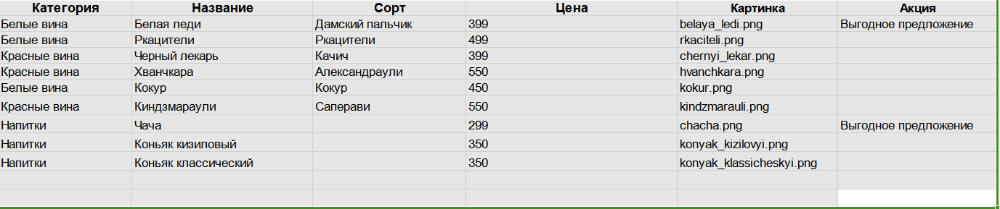

# Новое русское вино

Сайт магазина авторского вина "Новое русское вино".

## Запуск

- Скачайте код:
  - '$ git clone https://github.com/ArtyomRom/wine.git'
- Через терминал перейдите в рабочую директорию и запустите `python3 main.py` и имя файла excel и имя листа
- Перейдите на сайт по адресу [http://127.0.0.1:8000](http://127.0.0.1:8000).
  - Если нужно изменить ассортимент магазина, необходимо изменить файл wine3.xlsx
    - ## Пример данных для ecxel файла: 

    | Категория | Название | Сорт      | Цена     | Картинка | Акция       |
    |-----------|----------|-----------|----------|----------|-------------|
    | Данные 1  | Данные 2  | Данные 3 | Данные 4 | Данные 5 | Данные  6   |
    
    - ## Пример самого файла
      

Python3 должен быть уже установлен. Затем используйте pip (или pip3, есть конфликт с Python2) для установки зависимостей:
pip install -r requirements.txt

## Цели проекта

Код написан в учебных целях — это урок в курсе по Python и веб-разработке на сайте [Devman](https://dvmn.org).
